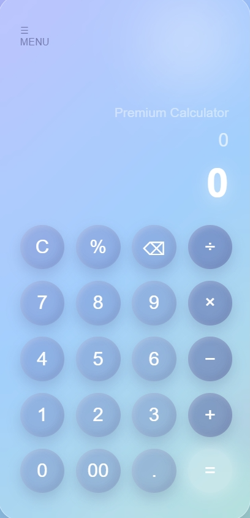

# 🧮 Premium Glass Calculator

A modern, stylish calculator built using **HTML, CSS, and JavaScript** with a beautiful glassmorphism UI and smooth animations.

---

## 🚀 Live Demo

👉 https://dishawaghmare30.github.io/calc/

---

## ✨ Features

* 🧊 Glassmorphism UI design
* 🎨 Animated gradient background blobs
* ⚡ Real-time calculation
* ⌫ Delete and Clear functions
* 💯 Percentage support
* 📱 Responsive design (works on mobile)

---

## 🛠️ Tech Stack

* **HTML** – Structure
* **CSS** – Styling & animations
* **JavaScript** – Logic & calculations

---

## 📸 Preview



---

## 📂 Project Structure

```
premium-calculator/
│
├── index.html
└── README.md
```

---

## ⚙️ How to Run Locally

1. Clone the repository:

   ```bash
   git clone https://github.com/your-username/premium-calculator.git
   ```

2. Open the project folder

3. Double-click `index.html`
   OR open with Live Server

---

## 🌐 Deployment

This project is deployed using **GitHub Pages**.

To deploy:

1. Go to repository **Settings**
2. Open **Pages**
3. Select branch: `main`
4. Save and get your live link

---

## 🧠 How It Works

* User clicks buttons → values are appended
* Expression is stored in a variable
* On `=` → expression is evaluated using JavaScript
* Result is displayed instantly

---

## ⚠️ Note

* Uses `eval()` for calculations (simple but not recommended for production apps)
* Best suited for learning and portfolio projects

---

## 👨‍💻 Author

**Soham Patil**
🔗 https://github.com/your-username

---

## ⭐ Support

If you like this project:

* ⭐ Star the repository
* 🍴 Fork it
* 📢 Share with others

---

## 📌 Future Improvements

* Scientific calculator features
* Keyboard input support
* Dark/Light mode toggle
* History tracking

---

### 💡 Made with passion for learning & building
